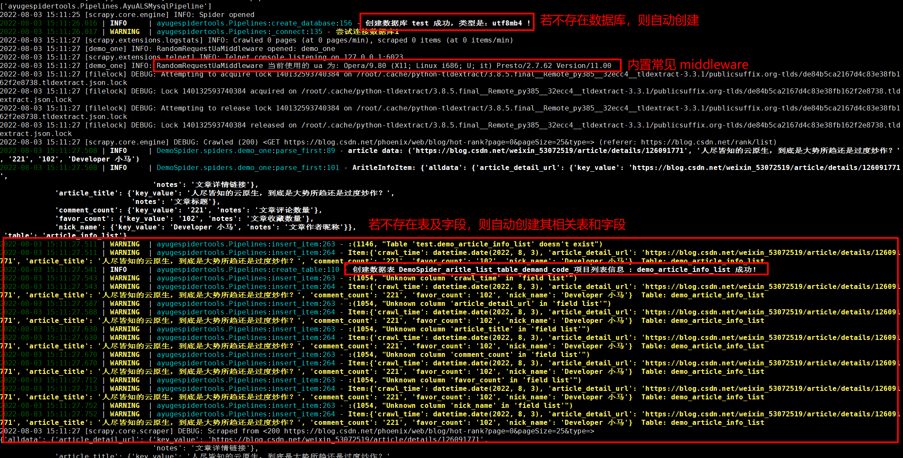
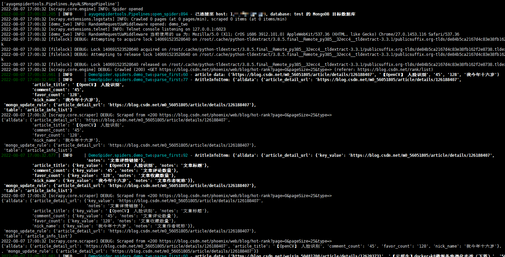
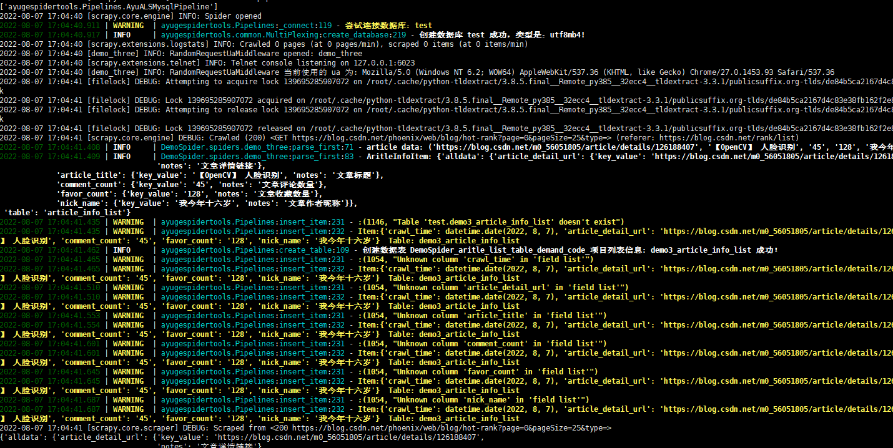
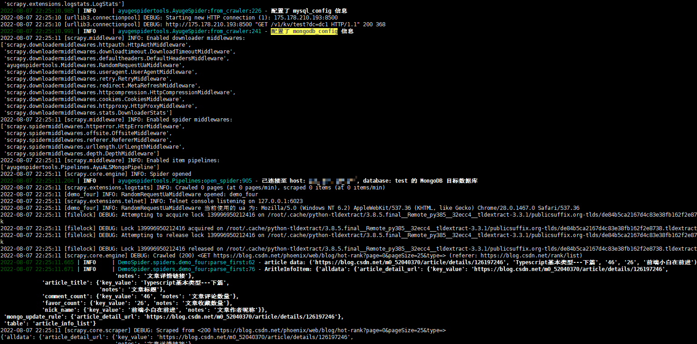
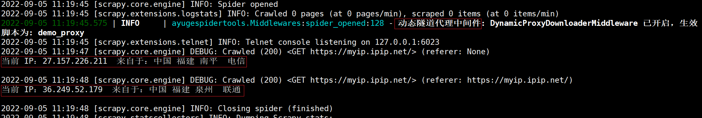

# DemoSpider 项目说明文档

## —— 之 AyugeSpiderTools 工具应用示例

> 本文章用于说明 `ayugespidertools` 的 `scrapy` 扩展库在 `python` 爬虫开发中的简单应用，可以**解放爬虫开发人员的双手**：不用关注 `item`, `middlewares` 和 `pipelines` 的编写，专心反爬和 `spiders` 的解析规则即可。

## 前言
本文是对 `AyugeSpiderTools` 工具的使用进行具体场景实现，由于此项目会经常变动和修改，所以独立成为一个专属项目，而不是放入 `AyugeSpiderTools` 项目的示例中。

详细的文档说明，还是根据 [ayugespidertools readthedocs](https://ayugespidertools.readthedocs.io/en/latest/) 说明为主。

## 1. 前提条件

> `python 3.8+` 可以直接输入以下命令：

```shell
pip install ayugespidertools -i https://pypi.org/simple
```

### 1.1. 运行方法

> 本扩展库用于方便 `python` 开发，本项目的应用场景的运行方法为：

只需要将本项目中的 `VIT` 文件夹下的 `.conf` 文件如下编辑，然后 `scrapy crawl xxxx` 对应的 `spiders` 脚本即可。

> `VIT` 文件夹中的 `.conf` 文件内容为，已脱敏，请按需自行配置：

项目中已给出 `.conf_example` 的示例文件，请对照你所复现的场景按需配置。

> 项目中各 `spiders` 脚本名称及其对应功能介绍，如下：

```diff
# 采集数据存入 `Mysql` 的场景：
+ 1).demo_one: 配置根据本地 `settings` 的 `LOCAL_MYSQL_CONFIG` 中取值
+ 3).demo_three: 配置根据 `consul` 的应用管理中心中取值
+ 5).demo_five: 异步存入 `Mysql` 的场景

# 采集数据存入 `MongoDB` 的场景：
+ 2).demo_two: 采集数据存入 `MongoDB` 的场景（配置根据本地 `settings` 的 `LOCAL_MONGODB_CONFIG` 中取值）
+ 4).demo_four: 采集数据存入 `MongoDB` 的场景（配置根据 `consul` 的应用管理中心中取值）
+ 6).demo_six: 异步存入 `MongoDB` 的场景

# 将 `Scrapy` 的 `Request`，`FormRequest` 替换为其它工具实现的场景
- 以上为使用 scrapy Request 的场景
+ 7).demo_seven: scrapy Request 替换为 requests 请求的场景(一般情况下不推荐使用，同步库
+ 会拖慢 scrapy 速度，可用于测试场景)

+ 8).demo_eight: 同时存入 Mysql 和 MongoDB 的场景

+ 9).demo_aiohttp_example: scrapy Request 替换为 aiohttp 请求的场景，提供了各种请求场景示例（GET,POST）
+ 10).demo_aiohttp_test: scrapy aiohttp 在具体项目中的使用方法示例

+ 11).demo_proxy_one: 快代理动态隧道代理示例
+ 12).demo_proxy_two: 测试快代理独享代理

+13).demo_AyuTurboMysqlPipeline: mysql 同步连接池的示例
+14).demo_crawl: 支持 scrapy CrawlSpider 的示例

# 本库中给出支持 Item Loaders 特性的示例(文档地址：https://ayugespidertools.readthedocs.io/en/latest/topics/loaders.html)
+15).demo_item_loader: 本库中使用 Item Loaders 的示例
-16).demo_item_loader_two: 展示本库使用 itemLoader 特性的示例，此示例已删除，可查看上个 demo_item_loader 中的示例，目标已经可以很方便的使用 Item Loaders 功能了

+17).demo_mongo_async: asyncio 版本存储 mongoDB 的 pipelines 示例
+18).demo_mq: 数据存入 rabbitmq 的模板示例，通过 pika 库实现
```


## 2. 运行结果图示

如果不存在目标数据库，数据表或表字段，则自动创建项目所依赖的数据库，数据表和表字段及字段说明。

注：以下运行截图非覆盖全场景，请自行查看本项目中 `spdier` 的各脚本内容。

> 下图为 `demo_one` 的 `Mysql` 取本地配置 `LOCAL_MYSQL_CONFIG` 下的运行示例：
>



> 下图为 `demo_two` 的 `MongDB` 存储的场景下的示例：
>



> 下图为 `demo_three` 的 `Mysql` 取 `consul` 应用管理中心的配置下的运行示例：
>

**要运行此示例时，只需配置 `APP_CONF_MANAGE` 为 `True`，且在 `.conf` 中设置 `CONSUL` 相关配置后，当前的 `spiders` 即从 `consul` 的应用管理中心中取相应配置。**



> 下图为 `demo_four` 的 `MongoDB` 取 `consul` 应用管理中心的配置下的运行示例：
>



> 下图为 `demo_proxy_one` 的快代理动态隧道代理运行示例：



