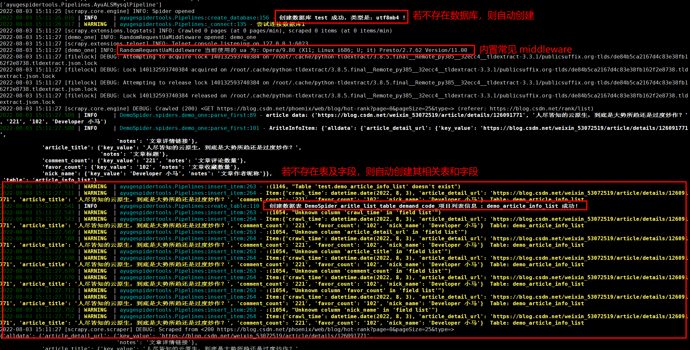
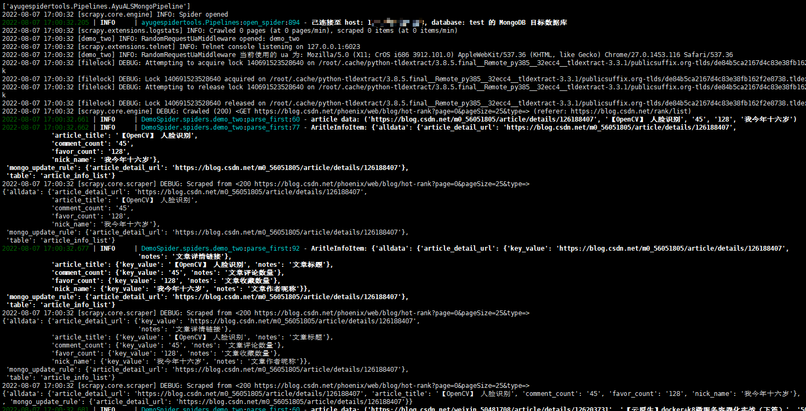
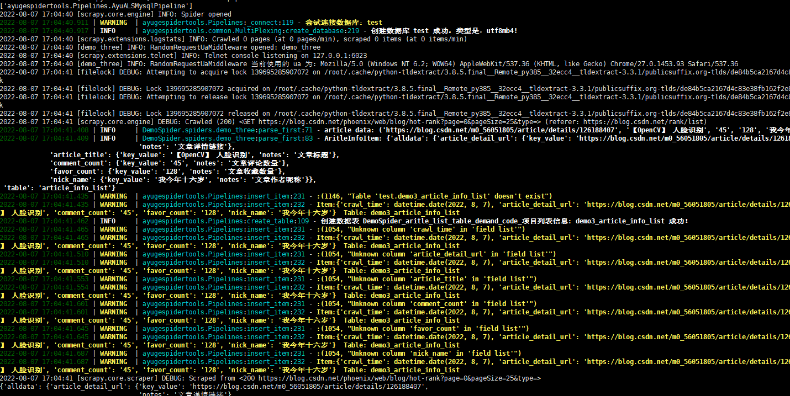
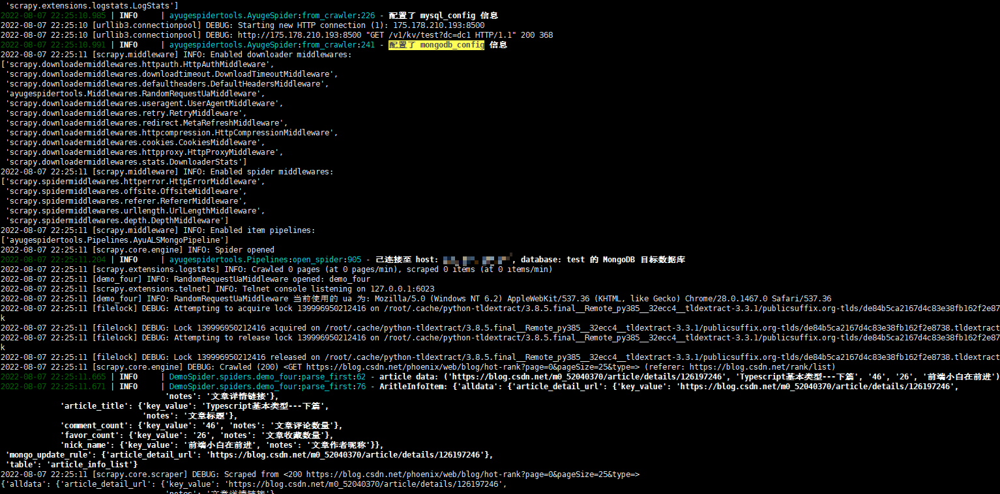
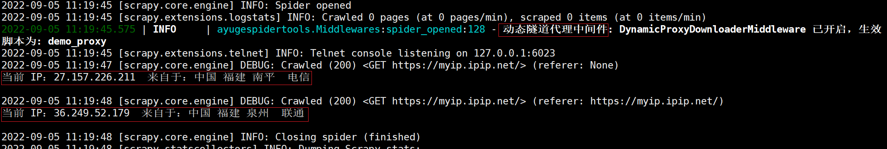

# DemoSpider 项目说明文档

## 前言
本文是对 `AyugeSpiderTools` 工具的使用进行具体场景实现，由于此项目会经常变动和修改，所以独立成为一个专属项目，而不是放入 `AyugeSpiderTools` 项目的示例中。

详细的文档说明，还是根据 [ayugespidertools readthedocs](https://ayugespidertools.readthedocs.io/en/latest/) 说明为主。

## 1. 前提条件

> `python 3.8+` 可以直接输入以下命令：

```shell
pip install ayugespidertools
```

### 1.1. 运行方法

只需要补充本项目中 `VIT` 下的 `.conf` 配置内容即可。

项目中已给出 `.conf_example` 的示例文件，请对照你想复现的场景按需配置。

`VIT` 文件夹路径默认在 `spiders` 文件夹同目录。当然，你也可以自定义。

> 项目中各 `spiders` 脚本名称及其对应功能介绍：

具体请在 `AyugeSpiderTools` 的 `readme` 中查看，这里不再重复。

然后，运行你所关心的 `spider` 即可。

## 2. 运行结果图示

如果不存在目标数据库，数据表或表字段，则自动创建项目所依赖的数据库，数据表和表字段及字段说明。

注：以下运行截图非覆盖全场景，请自行查看本项目中 `spdier` 的各脚本内容。

> 下图为 `demo_one` 的 `Mysql` 取本地配置下的运行示例：
>



> 下图为 `demo_two` 的 `MongDB` 存储的场景下的示例：
>



> 下图为 `demo_three` 的 `Mysql` 取 `consul` 中的配置下的运行示例：
>

**要运行此示例时，只需配置 `APP_CONF_MANAGE` 为 `True`，且在 `.conf` 中设置 `CONSUL` 相关配置后，当前的 `spiders` 即从 `consul` 中取相应配置。**



> 下图为 `demo_four` 的 `MongoDB` 取 `consul` 中的配置下的运行示例：
>



> 下图为 `demo_proxy_one` 的快代理动态隧道代理运行示例：


